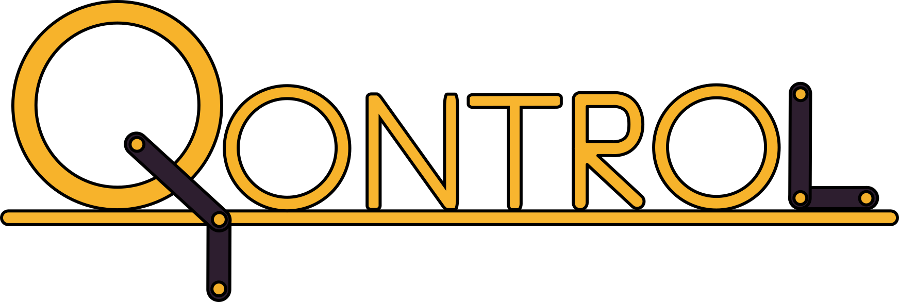

# Qontrol

In an effort to become more familiar with reinforcement learning, I decided to dive into Q-Learning. I have implemented a simple Q-Learning framework that I am using to solve the control problems in the OpenAI Gym package (CartPole, Acrobat, MountainCar, and Pendulum). After I have found a good set of parameters for each environment I will move on to implementing Deep Q-Learning.

I decided to start with Q-Learning because it is a pretty straightforward RL algorithm, and because of the recent breakthroughs in gameplay with Deep Q networks.

## Features
    - Despite the elements of an observation often being real valued and unbounded, large values are rarely (if ever) seen. Thus the Q table supports quantizine the observation space to whatever granularity you want. Just supply minimum, maximum, and number of bins for each observation and the Q table will take care of the rest.
    - Some important parameters cannot be learned in the traditional sense (learning rate, epsilon greedy-ness rate, number of quantization bins), so I have implemented a fully parallelizable gridsearch for hyperparameter optimization
    - Real time plotting of cumulative reward, epsilon-greedy rate, and learning rate.
